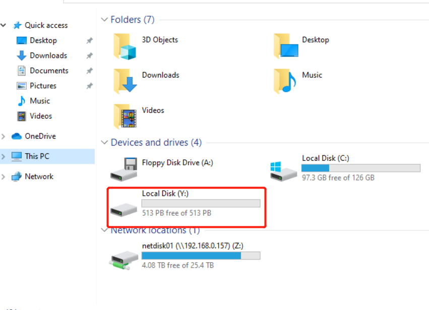

```bash
  ______     ______   ______
 /\  ___\   /\  ___\ /\  ___\
 \ \  __\   \ \  __\ \ \___  \
  \ \_____\  \ \_\    \/\_____\
   \/_____/   \/_/     \/_____/

```

# Elephas File System

## Introduction

EFS is a simple "distributed" file system. It's very suitable for small company to handle their different server storage resources.

1. collect storage resources from different servers (win/linux) and provide a common entrance to users

2. uniform permission management system

## Architecture

One *NameNode* and several *DataNode*s.

NameNode has the users' configs and DataNode configs. Not like HDFS, it won't store the file metadata. So it can avoid the [small file issue](https://www.sciencedirect.com/science/article/pii/S1319157821002585) of HDFS.

DataNode store the file metadata in [RocksDB](https://github.com/facebook/rocksdb) and store the file in its local disk. Actually RocksDB is used in [Facebook for metadata store](https://www.usenix.org/system/files/fast21-pan.pdf). DataNode reports its status to NameNode periodically.

The structure and permission of the filesystem is consistent with the Linux file system. The root directory is `/`. Every datanode handles different folders. 

For example, 

| name | ip | folders |
|---|---|---|
|datanode01|10.0.0.2| /volume01, /data/data01 |
|datanode02|10.0.0.3| /volume02, /data/data02, /users |


So `/volume01, /data/data01` are on `datanode01(10.0.0.2)` and `/volume02,/data/data02,/users` are on datanode02.

The client connects to NameNode and get the DataNode configs and then it will only communicates with the DataNodes to read/write files.

So it is not a real distributed filesystem: it has no replica and something  like distributed blobs. But it is very suitable for small company to handle their different server storage resources.

## Example

### Start NameNode

```bash
./efs-server namenode NameNodeConfig.yaml
```

### Start DataNode
```bash
./efs-server datanode DataNodeConfig01.yaml
./efs-server datanode DataNodeConfig02.yaml
```

### efs-client

This is a command line tool to connect and mount EFS. It provide internal command to manipulate the EFS.

```
./efs-client.exe
  ______     ______   ______
 /\  ___\   /\  ___\ /\  ___\
 \ \  __\   \ \  __\ \ \___  \
  \ \_____\  \ \_\    \/\_____\
   \/_____/   \/_/     \/_____/


---------- account  ----------
 namenode_addr: 192.168.0.179
 namenode_port: 20000
 user: guest
 password: guest

guest@efs /
> The service efs-client has been started.

guest@efs /
> 
```

`login` will login the EFS and `mount` will mount the EFS to your local disk 



* For windows, please install [winfsp](https://github.com/winfsp/winfsp)
* For Linux, not support yet but it easy to migrate to [libfuse](https://github.com/libfuse/libfuse)

### efs-client-python

You can use `efspy` to connect to EFS directly. It's not fully supported yet.


## Dev Plan

1. efs-client support Linux libfuse
2. efs-client-python implement
3. efs-client gui
4. performance improvement
5. more test ...

Please start to use it and give feedback or just star it! Help is needed and anything is welcome.
